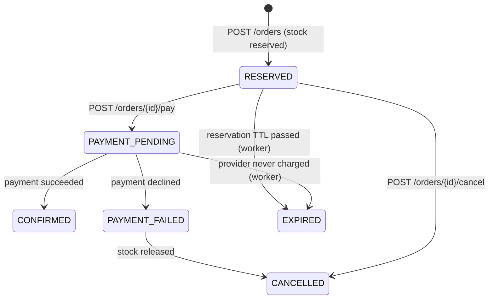

# API Reference

Base URL: `http://localhost:8080` locally, or your Render URL in production.
All business endpoints are under `/api/v1` and accept and return JSON.

Every request and response on this page was produced by running these exact `curl` commands
against the running stack (`docker compose up -d`). Long values (tokens, timestamps) are
shortened with `…`.

> **Windows:** run the commands in **Git Bash** (ships with Git for Windows). In PowerShell,
> `curl` means `Invoke-WebRequest`, and PowerShell 5.1 mangles JSON quotes passed to
> `curl.exe`. PowerShell versions of the main flows are in the [README walkthrough](../README.md#walkthrough-from-zero-to-a-paid-order).

```bash
BASE=http://localhost:8080
API=$BASE/api/v1
```

## Contents

- [Conventions](#conventions): auth, money, errors, request ids, rate limits
- [System](#system): `GET /health`, `GET /ready`, `GET /metrics`
- [Auth](#auth): register, login, me
- [Products](#products): list, get, create, update, archive
- [Inventory](#inventory) (admin): get, adjust, set
- [Orders](#orders): create (idempotent), list, get, pay, cancel
- [Error codes](#error-codes)

---

## Conventions

### Authentication

`POST /auth/login` returns a JWT. Send it on protected routes:

```
Authorization: Bearer <access_token>
```

| Auth column | Meaning |
|---|---|
| none | Public |
| Bearer | Any logged-in user (CUSTOMER or ADMIN) |
| Admin | A logged-in user with role `ADMIN` (else `403 FORBIDDEN`) |

Tokens expire after `JWT_TTL` (1 h). The role is inside the token, so after a user is promoted
to ADMIN they must log in again.

### Money

Amounts are **integers in minor units** (paise, cents) plus an ISO currency code:
`"price": 129900, "currency": "INR"` means ₹1,299.00. Floats are never used for money.

### Errors

Every error has the same shape. `fields` appears only on `VALIDATION_ERROR`:

```json
{
  "error": {
    "code": "VALIDATION_ERROR",
    "message": "one or more fields are invalid",
    "fields": { "email": "must be a valid email address" },
    "request_id": "ccc0ff4d48e3a9d36b9e14e0e73eca22"
  }
}
```

Program against `code`, not `message`. The full list is in [Error codes](#error-codes).

### Request ids

Every response has an `X-Request-ID` header. The same id appears in error bodies and in the
server's log line for that request. Send your own `X-Request-ID` to trace a call end to end.

### Rate limits

When Redis is configured, each client gets `RATE_LIMIT_PER_MINUTE` (100) requests per minute:
per IP on public routes, per user on authenticated routes. Responses carry
`X-RateLimit-Limit` and `X-RateLimit-Remaining`. Over the limit you get
`429 RATE_LIMITED` with a `Retry-After` header (seconds).

### Request bodies

Unknown JSON fields are rejected (`400`), and the body must be a single JSON object (max 1 MB).
This catches typos like `"quantitiy"` instead of silently ignoring them.

---

## System

### `GET /health`: liveness

Auth: none. Returns 200 while the process is running. It never checks dependencies, so a
database outage doesn't trigger restart loops.

```bash
curl -i $BASE/health
```
```
HTTP/1.1 200 OK
{"status":"ok"}
```

### `GET /ready`: readiness

Auth: none. Can this instance serve traffic?

```bash
curl $BASE/ready
```
```json
{"status":"ready","checks":{"postgres":"ok","redis":"ok"}}
```

| Status | Body `status` | Meaning |
|---|---|---|
| 200 | `ready` | Everything is up |
| 200 | `degraded` | Redis (optional) is down; the API works without the cache and rate limiting |
| 503 | `not_ready` | PostgreSQL (required) is down |

### `GET /metrics`: Prometheus metrics

Auth: none (keep it on an internal network in production). Text format. See
[docs/learning/14-observability.md](learning/14-observability.md).

```bash
curl -s $BASE/metrics | grep '^orders_created_total'
```
```
orders_created_total 4
```

---

## Auth

### `POST /api/v1/auth/register`

Auth: none. Creates a **CUSTOMER** account. Admins are promoted in the database (see
README → *Creating an admin*).

| Field | Rules |
|---|---|
| `email` | Valid address, max 254 characters, unique ignoring case (`Alice@x.com` = `alice@x.com`, PostgreSQL `CITEXT`) |
| `name` | Required, max 100 characters |
| `password` | 8–72 bytes (stored as a bcrypt hash, never in plain text) |

```bash
curl -i -X POST $API/auth/register -H "Content-Type: application/json" \
  -d '{"email":"alice@example.com","name":"Alice","password":"super-secret-1"}'
```
```
HTTP/1.1 201 Created
{"id":661,"email":"alice@example.com","name":"Alice","role":"CUSTOMER","created_at":"2026-10-01T10:01:59.40168Z"}
```

| Errors | When |
|---|---|
| `400 VALIDATION_ERROR` | `{"email":"must be a valid email address","name":"is required","password":"must be at least 8 characters"}` |
| `409 EMAIL_ALREADY_EXISTS` | The email is taken |

### `POST /api/v1/auth/login`

Auth: none.

```bash
curl -X POST $API/auth/login -H "Content-Type: application/json" \
  -d '{"email":"alice@example.com","password":"super-secret-1"}'
```
```json
{
  "access_token": "eyJhbGciOiJIUzI1NiIsInR5cCI6IkpXVCJ9.…",
  "token_type": "Bearer",
  "expires_in": 3599,
  "expires_at": "2026-10-01T11:01:59.98511106Z",
  "user": {"id":661,"email":"alice@example.com","name":"Alice","role":"CUSTOMER","created_at":"…"}
}
```

Save the token for the next calls:

```bash
TOKEN=$(curl -s -X POST $API/auth/login -H "Content-Type: application/json" \
  -d '{"email":"alice@example.com","password":"super-secret-1"}' | sed -E 's/.*"access_token":"([^"]+)".*/\1/')
```

| Errors | When |
|---|---|
| `400 VALIDATION_ERROR` | Missing fields or malformed JSON |
| `401 INVALID_CREDENTIALS` | Wrong email **or** password (the message never says which, so accounts can't be enumerated) |

### `GET /api/v1/users/me`

Auth: Bearer.

```bash
curl $API/users/me -H "Authorization: Bearer $TOKEN"
```
```json
{"id":661,"email":"alice@example.com","name":"Alice","role":"CUSTOMER","created_at":"2026-10-01T10:01:59.40168Z"}
```

| Errors | When |
|---|---|
| `401 UNAUTHENTICATED` | Missing, malformed, expired or forged token |

---

## Products

Product fields: `id`, `sku`, `name`, `description`, `price`, `currency`, `status`
(`ACTIVE` / `INACTIVE` / `ARCHIVED`), `created_at`, `updated_at`.

### `GET /api/v1/products`

Auth: none.

| Query | Default | Rules |
|---|---|---|
| `q` | – | Search in name and SKU, max 100 characters |
| `status` | `ACTIVE` | `ACTIVE` or `INACTIVE` (archived products are never listed) |
| `sort` | `newest` | `newest`, `oldest`, `price_asc`, `price_desc`, `name` |
| `limit` | 20 | 1–100 |
| `offset` | 0 | ≥ 0 |

```bash
curl "$API/products?q=wireless&sort=price_asc&limit=2"
```
```json
{
  "items": [
    {"id":17,"sku":"DOC-14747","name":"Wireless Mouse","description":"2.4 GHz, silent clicks","price":129900,"currency":"INR","status":"ACTIVE","created_at":"…","updated_at":"…"},
    {"id":2,"sku":"MOUSE-01","name":"Wireless Mouse","description":"","price":199900,"currency":"INR","status":"ACTIVE","created_at":"…","updated_at":"…"}
  ],
  "total": 2, "limit": 2, "offset": 0
}
```

Errors: `400 VALIDATION_ERROR` (bad `status`, `sort`, `limit` or `offset`).

### `GET /api/v1/products/{id}`

Auth: none. Served from the Redis cache when possible (5 min TTL, removed on update).

```bash
curl $API/products/17
```
```json
{"id":17,"sku":"DOC-14747","name":"Wireless Mouse","description":"2.4 GHz, silent clicks","price":129900,"currency":"INR","status":"ACTIVE","created_at":"…","updated_at":"…"}
```

| Errors | When |
|---|---|
| `400 VALIDATION_ERROR` | `id` is not a positive integer |
| `404 NOT_FOUND` | No such product, or it is archived |

### `POST /api/v1/products`

Auth: **Admin**. Also creates the product's inventory row with 0 units.

| Field | Rules |
|---|---|
| `sku` | Required, 2–64 characters: letters, digits, `-`, `_`; stored upper-case; unique |
| `name` | Required, max 200 characters |
| `description` | Optional, max 2000 characters |
| `price` | 1 – 1 000 000 000 (minor units) |
| `currency` | 3-letter ISO code, e.g. `INR`, `USD` |
| `status` | Optional: `ACTIVE` (default) or `INACTIVE` |

```bash
curl -X POST $API/products -H "Authorization: Bearer $ADMIN_TOKEN" -H "Content-Type: application/json" \
  -d '{"sku":"MOUSE-02","name":"Wireless Mouse","description":"2.4 GHz, silent clicks","price":129900,"currency":"INR"}'
```
```
HTTP/1.1 201 Created
{"id":17,"sku":"MOUSE-02","name":"Wireless Mouse","description":"2.4 GHz, silent clicks","price":129900,"currency":"INR","status":"ACTIVE","created_at":"…","updated_at":"…"}
```

| Errors | When |
|---|---|
| `400 VALIDATION_ERROR` | Invalid fields |
| `401 UNAUTHENTICATED` | No token |
| `403 FORBIDDEN` | Logged in, but not an ADMIN |
| `409 SKU_ALREADY_EXISTS` | The SKU is taken |

### `PATCH /api/v1/products/{id}`

Auth: **Admin**. Partial update: send only the fields to change (`name`, `description`,
`price`, `currency`, `status`). The SKU never changes. Orders already placed keep their price
snapshot.

```bash
curl -X PATCH $API/products/17 -H "Authorization: Bearer $ADMIN_TOKEN" -H "Content-Type: application/json" \
  -d '{"price":99900}'
```
```json
{"id":17,"sku":"MOUSE-02","name":"Wireless Mouse","description":"2.4 GHz, silent clicks","price":99900,"currency":"INR","status":"ACTIVE","created_at":"…","updated_at":"…"}
```

Errors: `400` (no fields / invalid), `401`, `403`, `404`.

### `DELETE /api/v1/products/{id}`

Auth: **Admin**. **Archives** the product (soft delete): order history still references it.
Archived products return 404 and can't be ordered.

```bash
curl -i -X DELETE $API/products/17 -H "Authorization: Bearer $ADMIN_TOKEN"
```
```
HTTP/1.1 204 No Content
```

Errors: `400`, `401`, `403`, `404`.

---

## Inventory

Fields: `product_id`, `available_quantity` (can be ordered), `reserved_quantity` (held by
unpaid orders), `version` (increases on every change; used for optimistic locking),
`updated_at`.

### `GET /api/v1/products/{id}/inventory`

Auth: **Admin**.

```bash
curl $API/products/17/inventory -H "Authorization: Bearer $ADMIN_TOKEN"
```
```json
{"product_id":17,"available_quantity":0,"reserved_quantity":0,"version":1,"updated_at":"…"}
```

Errors: `400`, `401`, `403`, `404`.

### `PATCH /api/v1/products/{id}/inventory`

Auth: **Admin**. Send **one** of two forms:

**Adjust** (relative, safe without a version, e.g. "a delivery of 50 arrived"). The row is
locked, so concurrent adjustments never lose an update. Range ±1 000 000.

```bash
curl -X PATCH $API/products/17/inventory -H "Authorization: Bearer $ADMIN_TOKEN" -H "Content-Type: application/json" \
  -d '{"adjustment":50}'
```
```json
{"product_id":17,"available_quantity":50,"reserved_quantity":0,"version":2,"updated_at":"…"}
```

**Set** (absolute, e.g. after a stock count). Requires the `version` you last read; if someone
changed the stock since, you get `409 VERSION_CONFLICT` instead of silently overwriting their
change.

```bash
curl -X PATCH $API/products/17/inventory -H "Authorization: Bearer $ADMIN_TOKEN" -H "Content-Type: application/json" \
  -d '{"available_quantity":45,"version":2}'
```
```json
{"product_id":17,"available_quantity":45,"reserved_quantity":0,"version":3,"updated_at":"…"}
```

| Errors | When |
|---|---|
| `400 VALIDATION_ERROR` | Both or neither form; out of range |
| `404 NOT_FOUND` | No such product |
| `409 INSUFFICIENT_STOCK` | `{"adjustment":-1000}` would make available stock negative |
| `409 VERSION_CONFLICT` | `version` is stale: GET again and retry |

---

## Orders

Order fields: `id`, `user_id`, `status`, `total_amount`, `currency`, `items[]`
(`product_id`, `quantity`, `unit_price`, `total_price`), `created_at`, `updated_at`.



### `POST /api/v1/orders`

Auth: Bearer. Creates the order **and reserves the stock in one transaction**. Prices are
copied from the products at this moment (a later price change doesn't affect the order).
The reservation lasts `RESERVATION_TTL` (15 min). Unpaid orders then expire and the stock
returns.

| Field | Rules |
|---|---|
| `items` | 1–50 lines |
| `items[].product_id` | Positive integer; product must be `ACTIVE`; one currency per order |
| `items[].quantity` | 1–1000 |

| Header | |
|---|---|
| `Idempotency-Key` | **Recommended.** Any unique string (≤ 255 chars), e.g. a UUID per checkout. Retrying with the same key and body returns the original order instead of creating a second one |

```bash
curl -i -X POST $API/orders -H "Authorization: Bearer $TOKEN" -H "Content-Type: application/json" \
  -H "Idempotency-Key: 6f1c2a9e-checkout-1" \
  -d '{"items":[{"product_id":17,"quantity":2}]}'
```
```
HTTP/1.1 201 Created
{"id":648,"user_id":661,"status":"RESERVED","total_amount":199800,"currency":"INR","items":[{"product_id":17,"quantity":2,"unit_price":99900,"total_price":199800}],"created_at":"…","updated_at":"…"}
```

The same request again (a network retry or a double-click) returns the **same** order:

```
HTTP/1.1 200 OK
Idempotent-Replayed: true
{"id":648, …}
```

| Errors | When |
|---|---|
| `400 VALIDATION_ERROR` | Empty items, quantity out of range, mixed currencies |
| `401 UNAUTHENTICATED` | No token |
| `409 OUT_OF_STOCK` | `"requested quantity is not available: product 17 has 43 available, 1000 requested"`. Nothing is reserved (the whole order rolls back) |
| `409 PRODUCT_UNAVAILABLE` | A product is INACTIVE, archived or doesn't exist |
| `409 IDEMPOTENCY_KEY_REUSED` | Same key, **different** body: use a new key for a new order |

### `GET /api/v1/orders`

Auth: Bearer. Customers see their own orders; admins see all. Items aren't included (use
`GET /orders/{id}`).

| Query | Default | Rules |
|---|---|---|
| `status` | – | Any order status, e.g. `CONFIRMED` |
| `limit` | 20 | 1–100 |
| `offset` | 0 | ≥ 0 |

```bash
curl "$API/orders?limit=1" -H "Authorization: Bearer $TOKEN"
```
```json
{"items":[{"id":648,"user_id":661,"status":"RESERVED","total_amount":199800,"currency":"INR","created_at":"…","updated_at":"…"}],"total":1,"limit":1,"offset":0}
```

### `GET /api/v1/orders/{id}`

Auth: Bearer. Someone else's order returns **404**, not 403, so order ids can't be probed.
Admins can read any order.

```bash
curl $API/orders/648 -H "Authorization: Bearer $TOKEN"
```
```json
{"id":648,"user_id":661,"status":"RESERVED","total_amount":199800,"currency":"INR","items":[{"product_id":17,"quantity":2,"unit_price":99900,"total_price":199800}],"created_at":"…","updated_at":"…"}
```

Errors: `400`, `401`, `404`.

### `POST /api/v1/orders/{id}/pay`

Auth: Bearer (the order's owner, or an admin). Charges the **mock** provider for a `RESERVED` order. Safe to
retry: the provider gets the same idempotency key every time, so a customer is never charged
twice.

Optional body, **mock provider only**, to demo the failure paths:
`{"simulate":"SUCCESS" | "FAILURE" | "TIMEOUT"}`. Without it, `MOCK_PAYMENT_OUTCOME` (default `SUCCESS`) applies.

```bash
curl -X POST $API/orders/648/pay -H "Authorization: Bearer $TOKEN"
```
```json
{
  "order":   {"id":648,"status":"CONFIRMED","total_amount":199800,"currency":"INR","items":[…], …},
  "payment": {"id":11,"order_id":648,"amount":199800,"currency":"INR","status":"SUCCEEDED",
              "provider_reference":"mock_ch_51001f24030fd342","created_at":"…","updated_at":"…"}
}
```

Paying an already-paid order again returns the same `200` result and **no second charge**.

**Declined:** the order is cancelled and its stock goes back to available.

```bash
curl -i -X POST $API/orders/649/pay -H "Authorization: Bearer $TOKEN" -H "Content-Type: application/json" \
  -d '{"simulate":"FAILURE"}'
```
```
HTTP/1.1 402 Payment Required
{"error":{"code":"PAYMENT_FAILED","message":"payment was declined (card_declined); the order was cancelled and its stock released","request_id":"…"}}
```

**Timeout:** the outcome is unknown, so nothing is released or confirmed yet. Retry the same
request: it asks the provider what happened instead of charging again. If nobody retries, the
worker resolves it after `PAYMENT_RECONCILE_AFTER`.

```bash
curl -i -X POST $API/orders/650/pay -H "Authorization: Bearer $TOKEN" -H "Content-Type: application/json" \
  -d '{"simulate":"TIMEOUT"}'
```
```
HTTP/1.1 504 Gateway Timeout
{"error":{"code":"PAYMENT_TIMEOUT","message":"the payment provider did not answer in time; the order is still PAYMENT_PENDING. Retry this request - you will not be charged twice","request_id":"…"}}
```
```bash
curl -X POST $API/orders/650/pay -H "Authorization: Bearer $TOKEN"     # retry -> 200, CONFIRMED
```

| Errors | When |
|---|---|
| `400 VALIDATION_ERROR` | Bad `simulate` value |
| `401` / `404` | Not logged in / not your order |
| `402 PAYMENT_FAILED` | Declined; order `CANCELLED`, stock released |
| `409 RESERVATION_EXPIRED` | The reservation ran out before payment: place a new order |
| `409 INVALID_STATE_TRANSITION` | The order can't be paid (e.g. it is `CANCELLED`) |
| `504 PAYMENT_TIMEOUT` | Outcome unknown, so retry |

### `POST /api/v1/orders/{id}/cancel`

Auth: Bearer (owner or admin). Allowed from `RESERVED`. The reserved stock goes back to
available in the same transaction.

```bash
curl -X POST $API/orders/652/cancel -H "Authorization: Bearer $TOKEN"
```
```json
{"id":652,"user_id":661,"status":"CANCELLED","total_amount":99900,"currency":"INR","items":[…],"created_at":"…","updated_at":"…"}
```

| Errors | When |
|---|---|
| `404 NOT_FOUND` | No such order, or not yours |
| `409 INVALID_STATE_TRANSITION` | `"invalid order status transition: CONFIRMED -> CANCELLED"` (paid orders need a refund flow, which is out of scope) |

---

## Error codes

| HTTP | Code | Meaning |
|---|---|---|
| 400 | `VALIDATION_ERROR` | Invalid input; see `fields` |
| 401 | `UNAUTHENTICATED` | Missing or invalid token |
| 401 | `INVALID_CREDENTIALS` | Wrong email or password |
| 402 | `PAYMENT_FAILED` | Payment declined; order cancelled, stock released |
| 403 | `FORBIDDEN` | Not allowed for your role |
| 404 | `NOT_FOUND` | Doesn't exist (or isn't yours) |
| 405 | `METHOD_NOT_ALLOWED` | Wrong HTTP method for this URL |
| 409 | `EMAIL_ALREADY_EXISTS` | Email taken |
| 409 | `SKU_ALREADY_EXISTS` | SKU taken |
| 409 | `OUT_OF_STOCK` | Not enough available stock |
| 409 | `PRODUCT_UNAVAILABLE` | Product inactive, archived or missing |
| 409 | `IDEMPOTENCY_KEY_REUSED` | Same key with a different body |
| 409 | `INSUFFICIENT_STOCK` | Inventory adjustment below zero |
| 409 | `VERSION_CONFLICT` | Stale inventory `version` |
| 409 | `RESERVATION_EXPIRED` | Too late to pay; place a new order |
| 409 | `INVALID_STATE_TRANSITION` | Order state doesn't allow this action |
| 429 | `RATE_LIMITED` | Too many requests; see `Retry-After` |
| 500 | `INTERNAL_ERROR` | Bug or outage; details only in server logs (search by `request_id`) |
| 504 | `PAYMENT_TIMEOUT` | Payment outcome unknown; retry is safe |
