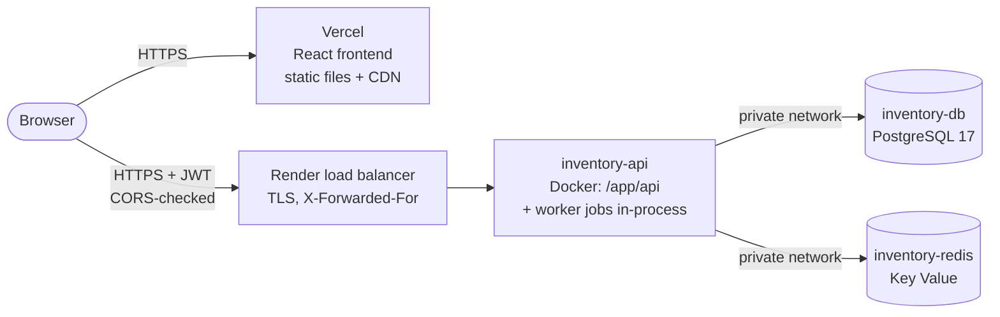

# Deployment Guide

Production setup used by this project:



| Part | Where | Cost |
|---|---|---|
| React frontend | Vercel | Free (Hobby) |
| Go API + background worker | Render web service (Docker) | Free |
| PostgreSQL 17 | Render Postgres | Free for 30 days, then paid or recreate |
| Redis | Render Key Value | Free |

Everything is described in [`render.yaml`](../render.yaml) (a Render **Blueprint**, i.e.
infrastructure as code) and [`frontend/vercel.json`](../frontend/vercel.json). No Kubernetes,
no extra cloud services.

---

## 1. Before you deploy

1. **Tests pass locally:** `.\scripts\test.ps1 -Race`
2. **The Docker image builds:** `docker compose build api`
3. **No secrets in git:** `git status` must not show `.env` (it's in `.gitignore`). Every secret
   in production comes from the platform: Render generates `JWT_SECRET` and `METRICS_TOKEN`.
4. **Push to GitHub.** Render and Vercel both deploy from a GitHub repository:

   ```powershell
   git remote add origin https://github.com/<you>/inventory-order-engine.git
   git push -u origin main
   ```

---

## 2. Backend on Render (Blueprint)

1. Create an account at [render.com](https://render.com) and connect your GitHub account.
2. **New → Blueprint**, then pick the repository. Render reads `render.yaml` and shows three
   resources: `inventory-db`, `inventory-redis` and `inventory-api`.
3. Render asks for **`CORS_ALLOWED_ORIGINS`** (marked `sync: false`). You don't have the Vercel
   URL yet, so enter `http://localhost:5173` for now. You'll change it in step 4.
4. Click **Apply**. Render will:
   - create PostgreSQL and Key Value (about 1–2 minutes);
   - build the `Dockerfile` (multi-stage build: a ~85 MB final image with Alpine plus the three Go binaries);
   - start `/app/api`, which **applies migrations** (`MIGRATE_ON_START=true`), starts the
     **worker jobs** in-process (`RUN_WORKER=true`) and listens on Render's `PORT`;
   - wait for `GET /health` to return 200, then route traffic to it.
5. Copy the service URL, e.g. `https://inventory-api-xxxx.onrender.com`.

### Verify the backend

```bash
API=https://inventory-api-xxxx.onrender.com
curl $API/health                 # {"status":"ok"}
curl $API/ready                  # {"status":"ready","checks":{"postgres":"ok","redis":"ok"}}
curl -X POST $API/api/v1/auth/register -H "Content-Type: application/json" \
  -d '{"email":"you@example.com","name":"You","password":"a-long-password"}'
```

In **Logs** you should see one JSON line per startup step: `migrations complete`,
`connected to redis`, `http server listening` on `:10000`, and `worker started`.

### Create the first admin

Registration always creates customers. Promote yourself directly in the database:

1. Render dashboard → **inventory-db** → **Connect** → copy the **External Database URL**.
2. Run `psql` from Docker (no local install needed):

   ```powershell
   docker run --rm -it postgres:17-alpine psql "<External Database URL>" `
     -c "UPDATE users SET role = 'ADMIN', updated_at = now() WHERE email = 'you@example.com';"
   ```

3. **Log in again.** The role is stored in the token, so old tokens keep the old role.

---

## 3. Frontend on Vercel

Full details are in [frontend/README.md](../frontend/README.md#4-deploy-to-vercel). In short:

1. [vercel.com](https://vercel.com) → **Add New → Project** → import the repository.
2. **Root Directory:** `frontend`. Vercel detects Vite; `vercel.json` sets the build and the
   SPA rewrites (deep links such as `/orders/42` work after a reload).
3. **Environment Variables:** `VITE_API_BASE_URL` = `https://inventory-api-xxxx.onrender.com`
   (no trailing slash). It's baked in **at build time**, so changing it needs a redeploy.
4. **Deploy.** You get e.g. `https://stockflow-you.vercel.app`.

## 4. Connect them (CORS)

Browsers block calls from the Vercel site to the API unless the API allows that origin:

1. Render → **inventory-api** → **Environment** → `CORS_ALLOWED_ORIGINS` =
   `https://stockflow-you.vercel.app` (exact origin: scheme + host, no path, no trailing slash;
   comma-separate several).
2. **Save Changes.** Render redeploys with the new value.
3. Open the Vercel URL, register, log in, and place an order.

---

## 5. Environment variables (production)

Set by `render.yaml` (you only type `CORS_ALLOWED_ORIGINS`):

| Variable | Value on Render | Why |
|---|---|---|
| `DATABASE_URL` | From `inventory-db` (private network URL) | Source of truth |
| `REDIS_URL` | From `inventory-redis` | Cache and rate limiting (optional) |
| `JWT_SECRET` | Generated (random 256-bit) | Signs tokens; must never be in git |
| `METRICS_TOKEN` | Generated | `/metrics` is on the public internet; Prometheus must send `Authorization: Bearer <token>` |
| `CORS_ALLOWED_ORIGINS` | Your Vercel URL | Lets the frontend call the API |
| `TRUSTED_PROXY_HOPS` | `1` | Render's load balancer is in front; the client IP for rate limiting comes from `X-Forwarded-For` |
| `MIGRATE_ON_START` | `true` | Free plan has no pre-deploy step |
| `RUN_WORKER` | `true` | Free plan has no background workers |
| `DB_MAX_CONNS` | `5` | Small free database |
| `PORT` | Set by Render (10000) | The API listens on it automatically |

All other settings keep their defaults (see [`.env.example`](../.env.example)), e.g.
`RESERVATION_TTL=15m`, `RATE_LIMIT_PER_MINUTE=100`, `MOCK_PAYMENT_OUTCOME=SUCCESS`.

---

## 6. Free-plan trade-offs (know these for interviews)

| Limitation | Effect | Why it's still correct |
|---|---|---|
| Web service **sleeps after 15 min** without traffic | First request takes ~1 min (cold start) | The frontend just waits. Nothing is lost: all state is in PostgreSQL |
| The in-process worker **sleeps with it** | Overdue reservations are released late (on the next wake-up), and the outbox publishes late | The worker works off `expires_at` and the outbox table, not timers in memory. Orders whose reservation expired **can't be paid** (`409 RESERVATION_EXPIRED`), so late cleanup never sells expired stock |
| Free PostgreSQL **expires after 30 days** | Data is deleted | Upgrade the plan, or recreate the Blueprint for demos |
| No pre-deploy command | Migrations run at API startup | The migration runner holds a PostgreSQL advisory lock, so two instances starting together never apply a migration twice |

### On a paid plan (recommended for anything real)

1. Set `MIGRATE_ON_START=false` and add `preDeployCommand: /app/migrate` to the web service.
   Migrations then run **once per deploy, before** the new version takes traffic, and a failed
   migration stops the deploy.
2. Set `RUN_WORKER=false` and uncomment the `inventory-worker` service in `render.yaml`
   (`dockerCommand: /app/worker`), so a slow job never competes with HTTP requests.
3. Use a paid PostgreSQL plan (daily backups, point-in-time recovery).
4. Run 2+ API instances. Nothing to change in code: state is in PostgreSQL/Redis, row locks
   work across instances, and the rate limiter's counters live in Redis.

---

## 7. Production checklist

- [x] Secrets only in environment variables; `JWT_SECRET` ≥ 32 characters (the API refuses to start otherwise)
- [x] Container runs as a non-root user (`USER appuser` in the Dockerfile)
- [x] TLS terminated by Render/Vercel (HTTPS everywhere)
- [x] CORS allow-list instead of `*`
- [x] Rate limiting per real client IP (`TRUSTED_PROXY_HOPS=1`)
- [x] `/health` for liveness, `/ready` for readiness, `/metrics` behind a token
- [x] Graceful shutdown: in-flight requests and the current worker job finish on `SIGTERM`
- [x] Structured JSON logs with `request_id`, viewable in Render's Logs tab
- [ ] **Payments are a mock.** The `simulate` body field exists for demos. A real deployment
      replaces `payments.MockProvider` with a real provider (Stripe/Razorpay) behind the same
      `Provider` interface, and confirms payments via signed webhooks
- [ ] Database backups (paid plan)
- [ ] Alerting on the metrics (5xx rate, p95 latency, `payments_failed_total`, outbox `dead`)

---

## 8. Troubleshooting

| Symptom | Cause / fix |
|---|---|
| Deploy fails: `JWT_SECRET is required and must be at least 32 characters` | The variable was deleted. Restore it (Render → Environment → Generate) |
| Deploy fails: `DATABASE_URL is required` | The database isn't linked; check `fromDatabase` in `render.yaml` |
| Browser console: *blocked by CORS policy* | `CORS_ALLOWED_ORIGINS` doesn't exactly match the Vercel origin (check `https://`, no trailing `/`) |
| Frontend calls `http://localhost:8080` in production | `VITE_API_BASE_URL` wasn't set **before** the Vercel build; set it and redeploy |
| First request takes ~1 minute | Free instance cold start (see §6) |
| `/ready` says `degraded` | Redis is unreachable; the API still works (no cache, no rate limiting) |
| Every anonymous user gets `429` together | `TRUSTED_PROXY_HOPS` isn't `1`, so all visitors share the load balancer's IP |
| `401` from `/metrics` | Expected: send `Authorization: Bearer $METRICS_TOKEN` |
| Locally: `go test -race` fails with *paging file is too small* | Not a code bug: the machine is out of memory. Build fewer packages at once: `$env:GOFLAGS="-p=2"`, or give Docker Desktop less RAM |

---

## 9. Other hosts

The app is a standard 12-factor container (config from env, logs to stdout, stateless
processes), so the same image runs anywhere that runs Docker:

- **A VM (e.g. a small cloud server):** `docker compose up -d` with a `.env` holding strong
  `POSTGRES_PASSWORD` and `JWT_SECRET` (the compose defaults are for local use only). Put a
  reverse proxy (Caddy/nginx) in front for HTTPS and set `TRUSTED_PROXY_HOPS=1`.
- **Fly.io / Railway / Cloud Run:** run `/app/api` (and `/app/worker`, or `RUN_WORKER=true`),
  provide `DATABASE_URL`, `REDIS_URL`, `JWT_SECRET`, and let the platform set `PORT`.

Learning notes on *why* each of these decisions was made:
[docs/learning/15-deployment.md](learning/15-deployment.md).
